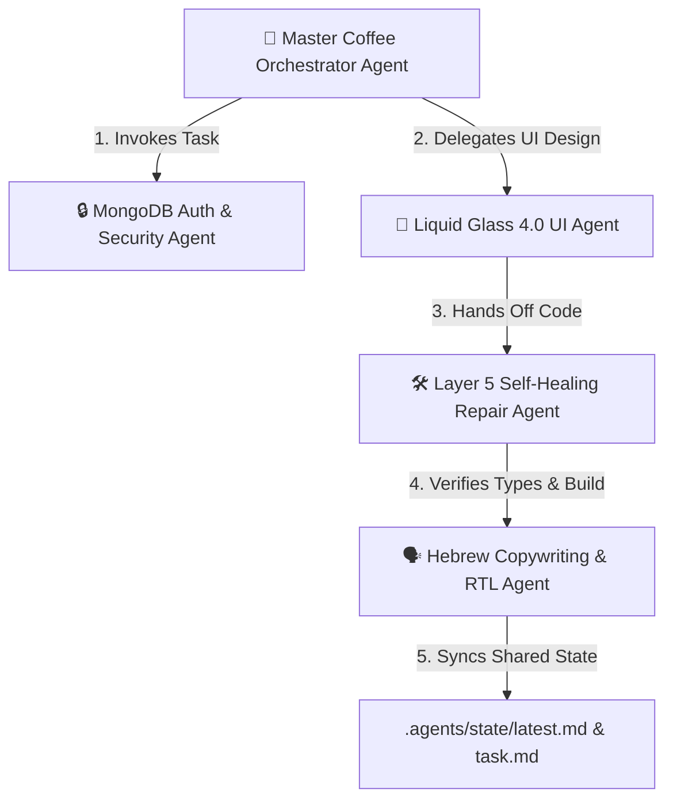

# 🤖 Inter-Agent Collaboration & Mesh Communication Protocol

## 1. Core Principles
All specialized AI Agents operating in `.agents` function as an autonomous mesh network. Sub-agents communicate, hand off state, and validate each other's outputs without requiring manual intervention.

---

## 2. Communication & Delegation Pipeline

---

## 3. Inter-Agent Communication Channels

1. **Sub-Agent Spawning (`invoke_subagent`):**
   - Master agent invokes specialized sub-agents (`define_subagent` & `invoke_subagent`) with isolated, targeted prompt scope and role descriptions.
   - Example roles: `Security Architect`, `Liquid Glass UX Engineer`, `TypeScript Self-Healing Specialist`.

2. **Direct Agent-to-Agent Messaging (`send_message`):**
   - Sub-agents pass structured JSON / Markdown messages to peer conversation IDs upon completion of sub-tasks.
   - Reactive wakeup notifies recipient agents immediately (zero manual polling).

3. **Shared Memory State Synchronization (`.agents/state/`):**
   - Every agent updates `.agents/state/task.md` and `.agents/state/latest.md` with completed steps (`- [x]`) and open hand-offs.
   - Context is kept dense and token-efficient.

---

## 4. Automated Hand-Off Protocol

- **UI Build Hand-Off:** `liquid-glass-ui` ➔ `self-healing-repair-loop` (Verifies build & type integrity).
- **AI Route Hand-Off:** `gemini-multimodal-barista` ➔ `mongodb-authentication` (Verifies Zod schema & session isolation).
- **Content Hand-Off:** `hebrew-rtl-copywriting` ➔ `global-hebrew-rtl` (Enforces `
` container & gourmet coffee taxonomy).

---

## 5. Rules for Agents
- Never duplicate work completed by another sub-agent. Read `.agents/state/latest.md` before initiating work.
- Always run `npm run build` or repair verification after code edits.
- Communicate in Hebrew RTL when outputting user-facing summaries.
