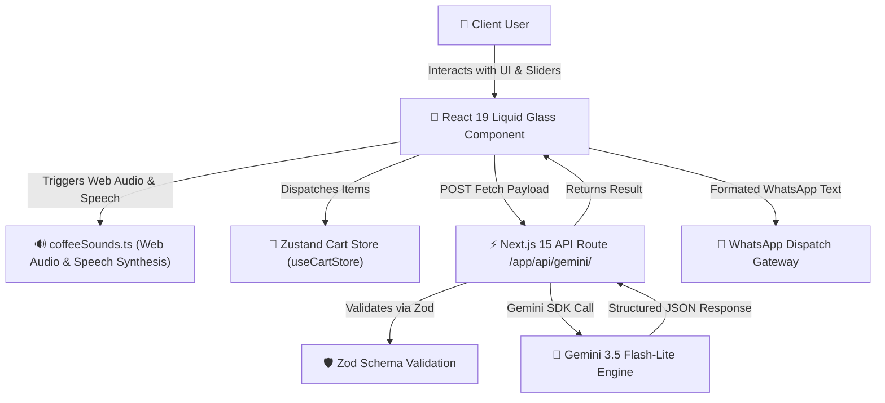

# 📐 Technical Specification (SPEC): [Module / Feature Name]

## 1. Architecture Overview
Technical specification for **[Module Name]** in **THE DIGITAL ROAST** platform, built on Next.js 15 App Router, React 19 Client/Server Components, MongoDB Mongoose ORM, Gemini 3.5 Multimodal AI, and Liquid Glass 4.0 Pro UI.

---

## 2. API Contract & Zod Validation Schemas

> [!CAUTION]
> Client components MUST import types using `import type { ... }` from API route modules to prevent Webpack client bundle pollution.

```typescript
import { z } from 'zod';

// Zod Validation Schema for API payload sanitization
export const FeatureOrderSchema = z.object({
  coffeeItemId: z.string().min(1, 'ID is required'),
  name: z.string().min(2, 'Name is required'),
  hebrewName: z.string().min(2, 'Hebrew name is required'),
  price: z.number().positive(),
  quantity: z.number().int().positive().default(1),
  roastLevel: z.enum(['LIGHT', 'CITY_PLUS', 'FULL_CITY', 'ITALIAN']),
  grindSetting: z.number().min(1).max(30).default(14),
  customNote: z.string().optional(),
  customerPhone: z.string().regex(/^05\d{8}$/, 'Must be a valid Israeli phone number (05XXXXXXXX)'),
});

export type FeatureOrderPayload = z.infer<typeof FeatureOrderSchema>;
```

---

## 3. Component Architecture & Data Flow



---

## 4. State Management & Web Audio Contracts

```typescript
// Sound & Speech Integration Contract
import { coffeeSound } from '@/lib/audio/coffeeSounds';

// Sound Effects
coffeeSound.playBaristaClick();    // Button & Tab navigation
coffeeSound.playSliderTick();      // Range sliders
coffeeSound.playBeanCrunch();      // Roast level selections
coffeeSound.playCoffeeSteam();     // AI calculation / Cart additions
coffeeSound.playTimerAlertSound(); // Timer countdown complete
coffeeSound.playSuccessChime();    // Order confirmation / Quest reward

// Hebrew Speech Synthesis (TTS)
coffeeSound.speakHebrew('ההזמנה נקלטה בהצלחה במערכת');
```

---

## 5. Security & Verification Strategy
- **Zod Input Sanitization:** Rejects malformed requests before executing Gemini AI calls or database writes.
- **Environment Isolation:** Accesses `MONGODB_URI` and `GEMINI_API_KEY` strictly on the server side in `app/api/`.
- **Bundle Safety:** Uses `import type` across all client components to guarantee 0 Webpack server-module bundle leaks.
